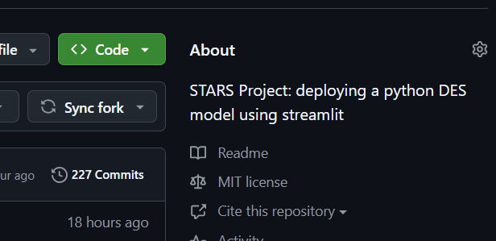
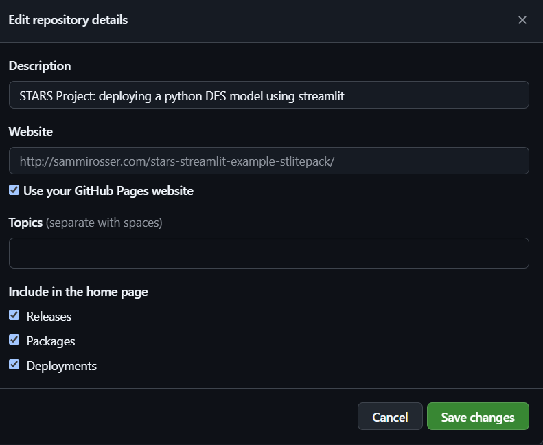

# stlitepack

[](https://pypi.org/project/stlitepack/)

stlitepack is a Python utility that helps you turn your existing Streamlit apps into [stlite apps — lightweight, browser-only Streamlit apps that run entirely in the client without a server](https://github.com/whitphx/stlite).

With stlitepack, you can:

- 📦 Pack your Streamlit app into a stlite-ready format
- 🗂️ Include additional resources like config.toml
- 🚀 Generate GitHub Actions workflows to (almost) auto-deploy your app to GitHub Pages

## 📦 Installation

```bash
pip install stlitepack
```

## 🚀 Usage

```python
from stlitepack import pack

# Pack your Streamlit app (e.g., "app.py") into a stlite bundle
pack("app.py")
```

This will create an `index.html` file in the same folder as your app file with all of the required stlite additions, which you can then serve as a static file using a hosting platform such as github pages.

If you're not familiar with Github pages, you can also use the `setup_github_pages()` function to help generate all the key files that will get your app up and hosted for users in moments.

```python
from stlitepack import setup_github_pages

setup_github_pages(mode="gh-actions")
```

This will generate

- a github workflow file
- a .nojekyll file (to prevent post-processing by github)
- a custom 404 page to make users redirect smoothly when your app is refreshed or shared
- a PAGES_SETUP.md file with instructions of how to enable github pages on your repository

Once you have followed the instructions in PAGES_SETUP.md, head over to the 'about' section of your repostiory and click on the cog.



Tick 'Use your GitHub Pages website' - your will likely take the form 'https://your-username.github.io/your-repository-name'


Then click 'save changes'



You can then click the link to head to your hosted app.


If the app has built successfully, there will be a green tick next to your last commit message:


### ⚠️ Heads Up!
Opening index.html directly in your browser may show navigation or media errors if you use session state in multi-page apps or if you are loading in external file. This is normal — it only happens when using file:// URLs.

Fix: Serve the app over HTTP (e.g., python -m http.server) or deploy to GitHub Pages.

Everything will work correctly once served via a web server!

For local testing prior to deployment, try running

```bash
python -m http.server 8000
```

from the root of your local repository.

Then open http://localhost:8000/index.html
(or change the path to reflect the final location of your created index.html file - e.g. http://localhost:8000/docs/index.html)


Alternatively, you can try setting `run_preview_server=True` in your `pack()` function call - this will try to spin up a server that points at the right document automatically, though this can be a bit temperamental with complex folder structures.

## 📖 Documentation

Check out the quickstart guide at [hsma-tools.github.io/stlitepack/stlitepack_docs/stlitepack_quickstart](http://hsma-tools.github.io/stlitepack/stlitepack_docs/stlitepack_quickstart).

You can also find the full reference for each function at [hsma-tools.github.io/stlitepack/reference/](http://hsma-tools.github.io/stlitepack/reference/).

The two key functions are

- [pack](https://hsma-tools.github.io/stlitepack/reference/pack.pack.html)
- [publish](https://hsma-tools.github.io/stlitepack/reference/publish.setup_github_pages.html)

## 🔮 Roadmap

- ✅ v0.1.0: Single-page app packing
- ✅ v0.2.0: Helper functions for GitHub Pages auto-deploy (via GitHub Actions workflow generation)
- ✅ v0.3.0: Multi-page app support (for [`pages/` subfolder](https://webapps.hsma.co.uk/multipage.html#method-2-pages-subfolder) method) and simple additional file inclusion
- ✅ v0.4.0: Lots of improvements!
    - Better support for resource bundling (images, CSVs, assets, config files etc.) of local or web-based file, also leading to multi-page app support via [`st.navigation()`](https://webapps.hsma.co.uk/multipage.html#method-1-st.page-and-st.navigation) method
    - Starting to automate changes of known stlite/streamlit differences (e.g. `await asyncio.sleep(1)` being required when using `st.spinner`)
    - Optional automatic spinning up of a preview server for the deployed app
    - Support for material icons
- ✅ v0.4.1: Bugfix for asyncio code
- ✅ v0.4.2: Automatic creation of a 404 redirect page
- ✅ v0.4.3: Change the default to a version of stlite to one known to work reliably (0.80.5)
- ✅ v0.4.4: Docstring fixes
- v0.4.5: Better documentation and testing of v0.4 features
- v0.5.0: Further auto-handling of stlite-specific required changes
- v0.6.0: Add support for generating the required package.json for [desktop app bundling](https://github.com/whitphx/stlite/tree/main/packages/desktop)
- v0.7.0: Add helpers for generating files for additional deployment options e.g. Docker, Caddy, Nginx, Apache
- v0.8.0: TOML or YAML file support as optional alternative to the packing function
- v1.0.0: Full toolkit for packaging, deploying, and managing stlite apps

## 📋 Examples of Use

*While these examples use a fork of the repository, there's nothing to stop you using stlite as part of your original repository - it's designed to keep all of your actual streamlit files untouched, so you can serve both a streamlit app and a streamlit community cloud hosted version from within the same repository*

### eFIT-tool

*An example with an app in the root directory which uses the 'pages' subfolder methods for a multipage streamlit app, and outputs the html file to the docs/ subfolder*

All credits go to [Peter Saiu](https://github.com/pete4nhs) and collaborators for the original repository!

- Packing script: [github.com/Bergam0t/eFIT-tool-stlitepack/blob/main/pack_to_stlite.py](https://github.com/Bergam0t/eFIT-tool-stlitepack/blob/main/pack_to_stlite.py)
- Hosted stlite app: [sammirosser.com/eFIT-tool-stlitepack/](https://sammirosser.com/eFIT-tool-stlitepack/)
- stlite Repository: [github.com/Bergam0t/eFIT-tool-stlitepack](https://github.com/Bergam0t/eFIT-tool-stlitepack)
- Original Repository: [github.com/pete4nhs/eFIT-tool](https://github.com/pete4nhs/eFIT-tool)

### Non-elective Flow Simulation

*An example with an app in an 'apps' subfolder, which uses the 'st.navigation' method for a multipage streamlit app, and outputs the html file to the root of the repository*

All credits go to [Helena Robinson](https://github.com/helenajr) and collaborators for the original repository!

- Packing script: [github.com/Bergam0t/hr_Non-Elective-Flow-Simulation/blob/main/app/pack.py](https://github.com/Bergam0t/hr_Non-Elective-Flow-Simulation/blob/main/app/pack.py)
- Hosted stlite app: [sammirosser.com/hr_Non-Elective-Flow-Simulation/](https://sammirosser.com/hr_Non-Elective-Flow-Simulation/)
- stlite Repository: [github.com/Bergam0t/hr_Non-Elective-Flow-Simulation](https://github.com/Bergam0t/hr_Non-Elective-Flow-Simulation)
- Original Repository: [github.com/Countess-of-Chester-Hospital-NHS-FT/Non-Elective-Flow-Simulation](https://github.com/Countess-of-Chester-Hospital-NHS-FT/Non-Elective-Flow-Simulation)


### Treatment Centre Simulation Model

*Another example with an app in the root directory which uses the 'pages' subfolder methods for a multipage streamlit app, and outputs the html file to the docs/ subfolder*

All credits go to [Tom Monks](https://github.com/TomMonks) and [Amy Heather](https://github.com/amyheather) for the original repository!

- Packing script: [github.com/Bergam0t/stars-streamlit-example-stlitepack/blob/main/pack_to_stlite.py](https://github.com/Bergam0t/stars-streamlit-example-stlitepack/blob/main/pack_to_stlite.py)
- Hosted stlite app: [sammirosser.com/stars-streamlit-example-stlitepack/](https://sammirosser.com/stars-streamlit-example-stlitepack/)
- stlite Repository: [github.com/Bergam0t/stars-streamlit-example-stlitepack](https://github.com/Bergam0t/stars-streamlit-example-stlitepack)
- Original Repository: [github.com/pythonhealthdatascience/stars-streamlit-example](https://github.com/pythonhealthdatascience/stars-streamlit-example)

## 🤝 Contributing
Contributions, feature requests, and feedback are welcome!

Open an issue or submit a pull request to help improve stlitepack.

### 🧪 Running Tests

To run tests, use

`pytest`

To generate a code coverage report, run

`pytest --cov-report xml:cov.xml --cov .`

## 📜 License
Apache 2.0 License. See LICENSE for details.

## 🙏 Acknowledgements

- [whitphx](https://github.com/whitphx) for creating the amazing [stlite](https://github.com/whitphx/stlite) framework!

## ↪️ Alternatives

Towards the end of the initial phase of development, I stumbled across a mention of Luke Fullard's [script2stlite](https://github.com/LukeAFullard/script2stlite)

Check that out if stlitepack doesn't meet your needs (or if you just want to see which approach you prefer!)

It's got some really nice features like support for embedding more types of files rather than requiring linking out to them on the web, and an approach using a config file instead of a packing function.

## 🤖 Generative AI Use Disclosure

This package was developed with the *assistance* of ChatGPT (OpenAI’s GPT-5 model) as a coding and documentation partner. Google Gemini Pro 2.5 was also used.
All code and design decisions were reviewed and finalized by a human, and any LLM output was used as a foundation rather than a final product.
